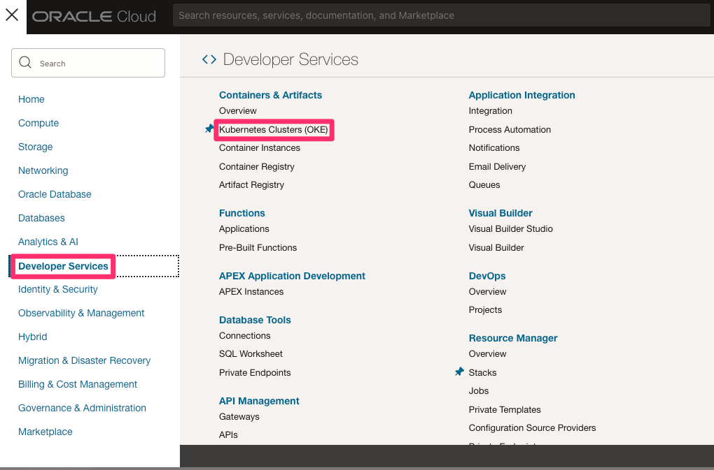
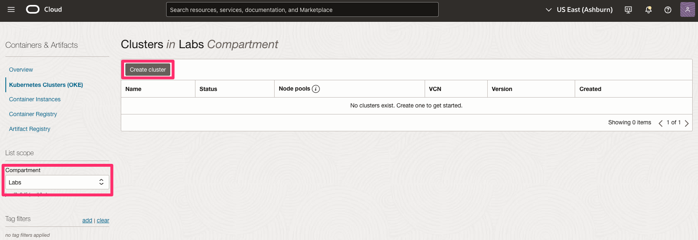
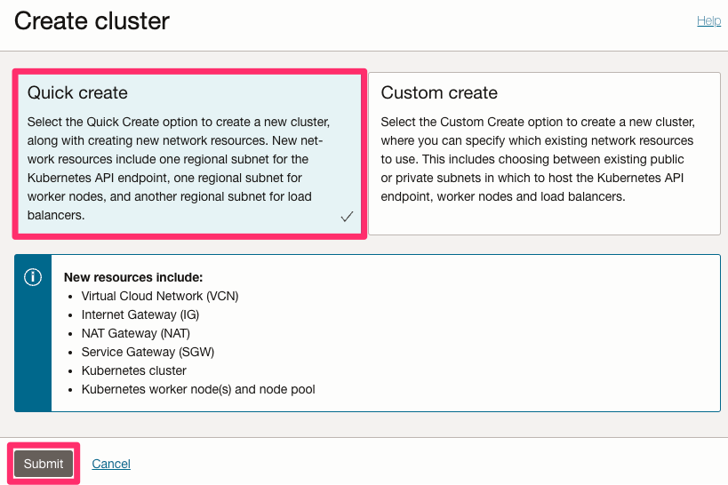
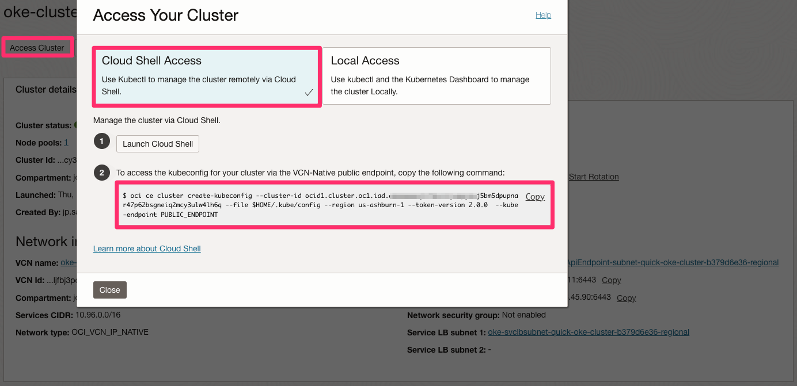

# Provision Oracle Container Engine for Kubernetes (OKE) cluster

## Introduction

A Kubernetes cluster consists of master and worker nodes running applications. It can be divided into namespaces for resource management. This lab demonstrates how to create a Kubernetes cluster

**Estimated Time**: 45 minutes

### Objectives

- Create a Kubernetes Cluster

### Prerequisites

- OCI CLI installed
- Basic understanding of Kubernetes

## Task 1: Create Kubernetes Cluster

1. From the OCI Services menu, click **Developer Services > Kubernetes Clusters (OKE)**.

	

2. Under **List Scope**, select the compartment in which you would like to create a cluster. Click **Create Cluster**.

	

3. Choose **Quick Create** and click **Submit**.

	

4. Fill out the dialog box:

	**Name**: Provide a name (oke-cluster in this example)

	**Compartment**: Choose your compartment

	**Kubernetes Version**: Choose the most recent version

	**Kubernetes API Endpoint**: Public Endpoint

	**Kubernetes Worker Nodes**: Private Workers

	**Shape**: VM.Standard.E5.Flex

	**Number of Nodes**: 1

5. Click **Next**.

	

6. Click **Create Cluster**.

	

	

## Task 2: Set Up Cloud Shell Access to Your Cluster

This section explains how to set up Cloud Shell to access and interact with your Kubernetes cluster. The Oracle Cloud Shell includes pre-installed tools like `kubectl`, `helm` and the OCI CLI, streamlining the configuration process.

1. Open Cloud Shell by clicking its icon in the top-right corner of the Oracle Cloud Console.

	

2. In the OKE console, click your cluster name. Then, click **Access Clusters** and select **Cloud Shell Access**. Copy the displayed command and paste it into Cloud Shell to run.

	

	

3. To test access to your cluster, list the worker nodes using the following command:

	```bash
	<copy>
	kubectl get nodes
	<copy>
	```

	

You may now proceed to the next lab.

## Acknowledgements

- **Author** - JP Santana, Master Cloud Architect, Oracle
- **Last Updated By/Date** - JP Santana, November 2024
